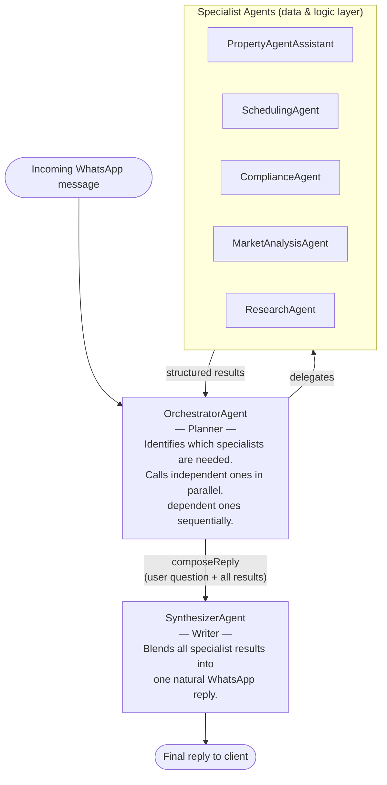
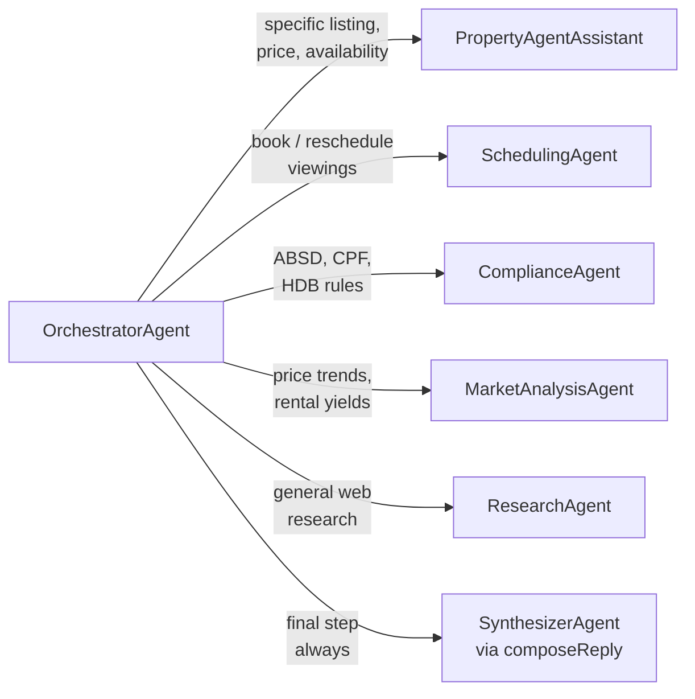

# Agents Reference

> **Working document** — updated as agents are added, promoted from scaffold, or removed.
> For the base class and shared config, see [core-agent.md](./core-agent.md).

---

## Framework Overview

The system uses a three-stage pipeline to handle incoming WhatsApp messages:



**Stage 1 — Orchestrator (Planner):** receives the user's message, decides which specialists to call, and collects their results. Always finishes by calling `composeReply`.

**Stage 2 — Specialists (Data layer):** each agent fetches data or applies logic for its domain. Returns structured, objective output — no client-facing tone.

**Stage 3 — Synthesizer (Writer):** receives the original user question and all specialist results; crafts one coherent, warm WhatsApp-style reply.

---

## Agent Registry

| Agent | File | Status | Tools |
|---|---|---|---|
| `OrchestratorAgent` | `agents/OrchestratorAgent.ts` | ✅ Active | delegates to specialists + `composeReply` |
| `SynthesizerAgent` | `agents/SynthesizerAgent.ts` | ✅ Active | none (pure generation) |
| `PropertyAgentAssistant` | `agents/PropertyAgentAssistant.ts` | ✅ Active | `lookupProperty`, `checkAvailability` |
| `ResearchAgent` | `agents/ResearchAgent.ts` | ✅ Active | `braveSearch`, `fetchPage` |
| `SchedulingAgent` | `agents/SchedulingAgent.ts` | ✅ Active (scaffold) | none — calendar integration pending |
| `ComplianceAgent` | `agents/ComplianceAgent.ts` | ✅ Active | none — SG rules baked into prompt |
| `MarketAnalysisAgent` | `agents/MarketAnalysisAgent.ts` | ✅ Active (scaffold) | none — URA/HDB API integration pending |
| `LeadQualificationAgent` | `agents/LeadQualificationAgent.ts` | 🔜 Other workflows | none — scaffold |
| `ListingWriterAgent` | `agents/ListingWriterAgent.ts` | 🔜 Other workflows | none — scaffold |

**Active** — wired into the orchestrator's tool routing and reachable from live conversations.
**Active (scaffold)** — routed by the orchestrator but backed by LLM knowledge only; real integrations (calendar, live data APIs) are planned.
**Other workflows** — not part of the WhatsApp orchestrator flow; reserved for separate workflows to be designed.

---

## Orchestrator routing map



---

## Agent Summaries

### `OrchestratorAgent`
**Role:** Planner. Receives every incoming WhatsApp message, decides which specialists to call, collects their results, and passes everything to `composeReply`.

**Key config:** `historyMode: 'text-only'` (keeps only final replies across turns, not tool internals), `maxSteps: 10`, `maxHistoryTurns: 20`.

**`composeReply` tool:** the mandatory final step. Always called after all specialists — calls `SynthesizerAgent.send()` with the original question and a labelled summary of all specialist results.

**Factory:** `createOrchestrator(sessionId, config?)` — instantiates all specialists automatically.

---

### `SynthesizerAgent`
**Role:** Writer. Receives the client's original question plus structured results from one or more specialists. Crafts a single, coherent WhatsApp-style reply that blends everything naturally.

**Key config:** `historyMode: 'text-only'`, `maxSteps: 1` (no tools — pure text generation). Stateless per call.

**Factory:** `createSynthesizer(sessionId, config?)`

---

### `PropertyAgentAssistant`
**Role:** Property data fetcher. Looks up listing details and viewing availability using real tools. Returns structured property data — no client-facing tone.

**Tools:** `lookupProperty(id)`, `checkAvailability(id, date)` — currently mock data; replace with CRM/calendar in production.

**Also used standalone** in `src/run.ts` for direct property agent demos.

**Factory:** `createPropertyAgentAssistant(sessionId, config?)`

---

### `ResearchAgent`
**Role:** Web researcher. Uses Brave Search and page fetching to find and synthesise information from the live web.

**Tools:** `braveSearch(query, count)`, `fetchPage(url)`.

**Key config:** `maxSteps: 6` (capped after prompt optimisation — see `DOCUMENTATION/research_agent_optimisation.md`).

**Also used standalone** in `src/runResearch.ts` and the interactive `src/replResearch.ts` REPL.

**Factory:** `createResearchAgent(sessionId, config?)`

---

### `SchedulingAgent` *(scaffold)*
**Role:** Viewing appointment manager. Handles booking, rescheduling, and cancellation requests. Returns structured confirmation details.

**Tools:** none yet — responds from LLM reasoning. Calendar API integration planned.

**Factory:** `createSchedulingAgent(sessionId, config?)`

---

### `ComplianceAgent`
**Role:** Singapore property regulation specialist. Answers questions on ABSD, BSD, CPF usage, HDB eligibility, and loan rules. All rules are baked into the system prompt.

**Tools:** none — rules are static reference data in the prompt. Can be upgraded to a live rules API if regulations change frequently.

**Factory:** `createComplianceAgent(sessionId, config?)`

---

### `MarketAnalysisAgent` *(scaffold)*
**Role:** Singapore property market analyst. Covers price trends by district, rental yields, investment return estimates, and comparable transactions. Currently draws on LLM training data and flags when figures may be outdated.

**Tools:** none yet — URA REALIS and HDB InfoWEB API integrations planned.

**Factory:** `createMarketAnalysisAgent(sessionId, config?)`

---

### `LeadQualificationAgent` *(other workflows)*
**Role:** Lead analyst. Extracts structured buyer/tenant profile information from client messages — budget, financing, preferences, timeline — and identifies what is still missing.

**Tools:** none.

**Status:** Not part of the WhatsApp orchestrator flow. Reserved for a dedicated lead qualification workflow to be designed separately.

**Factory:** `createLeadQualificationAgent(sessionId, config?)`

---

### `ListingWriterAgent` *(other workflows)*
**Role:** Marketing copywriter. Generates PropertyGuru/99.co listing descriptions, WhatsApp property summaries, and post-viewing follow-up messages.

**Tools:** none.

**Status:** Not part of the WhatsApp orchestrator flow. Reserved for a dedicated listing creation workflow to be designed separately.

**Factory:** `createListingWriterAgent(sessionId, config?)`

---

## How to add a new agent

### Step 1 — Create the file

```ts
// src/agents/MyAgent.ts
import { Agent, type AgentConfig } from '../core/Agent.js';
import { model } from '../provider.js';

export class MyAgent extends Agent {
  readonly name = 'MyAgent';
  protected readonly systemPrompt = `...objective data-fetching or analysis instructions...`;
  protected readonly tools = { myTool };
}

export function createMyAgent(sessionId: string, config?: AgentConfig): MyAgent {
  return new MyAgent(model, sessionId, config);
}
```

### Step 2 — Wire into the orchestrator

In `OrchestratorAgent.ts`:
1. Import the factory function
2. Add to `SpecialistRegistry`
3. Instantiate in `createOrchestrator()` with a derived session ID
4. Add a `delegateTo()` entry in `this.tools` with a routing description
5. Add a one-line description to the orchestrator's system prompt

### Step 3 — Keep the specialist objective

Specialist prompts should return structured data, not client-facing replies. The `SynthesizerAgent` handles all tone, warmth, and WhatsApp formatting.
