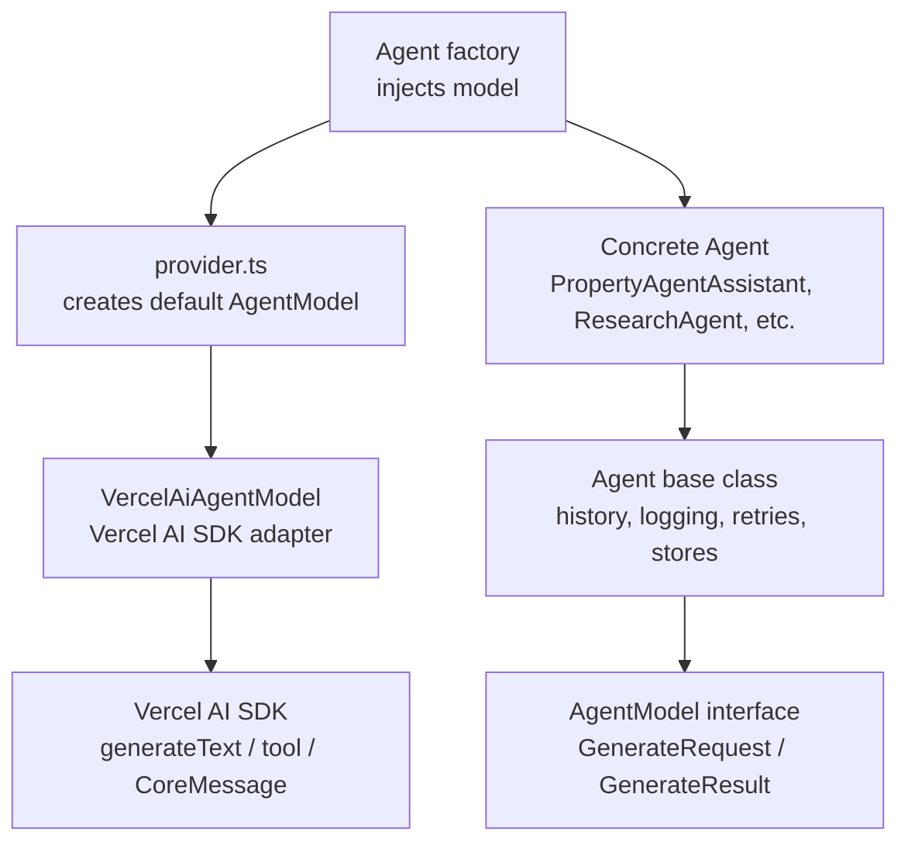

# SDK Decoupling Strategy

This project uses the Vercel AI SDK at runtime, but concrete agents do not depend on Vercel AI SDK types directly. The SDK boundary is pushed down into a small adapter layer so agent code can stay stable if the model provider or SDK changes later.

The short version:



Concrete agents know about `Agent`, `AgentModel`, `ToolSet`, and project-owned tools. Factory functions get a model from `provider.ts` and inject it into the agent constructor. Only the adapter knows about `generateText`, `LanguageModel`, `CoreMessage`, `CoreTool`, and the SDK `tool()` helper.

---

## Why This Exists

Without this boundary, every concrete agent would import SDK types such as `LanguageModel`, `CoreTool`, or `CoreMessage`. That makes future SDK changes expensive because a provider or SDK upgrade would ripple through `src/agents/`, `src/store/`, and tool definitions.

The current design keeps vendor-specific details in one place:

```text
src/core/adapters/VercelAiAgentModel.ts
```

If the app keeps using Vercel AI SDK, nothing changes for agent authors. If the app later moves to another SDK, most work should happen in a new adapter and provider wiring, not in every agent.

---

## The Key Types

### `Agent`

**File:** `src/core/Agent.ts`

`Agent` is the abstract base class for all concrete agents. It owns framework behavior:

- loading and saving session history
- appending user and assistant messages
- calling the model
- handling full vs text-only history
- warning on tool errors
- reloading managed skills
- writing conversation logs

A concrete agent only declares:

```ts
class MyAgent extends Agent {
  readonly name = 'MyAgent';
  protected readonly systemPrompt = '...';
  protected readonly tools = { myTool };
}
```

The important detail is that `Agent` calls:

```ts
await this.model.generate(...)
```

It does not call `generateText()` directly. This is what decouples the base agent logic from the Vercel AI SDK.

### `AgentModel`

**File:** `src/core/AgentModel.ts`

`AgentModel` is the local model contract:

```ts
export interface AgentModel {
  generate(request: GenerateRequest): Promise<GenerateResult>;
}
```

`GenerateRequest` contains project-owned message and tool types:

- `Message[]`
- `ToolSet`
- `maxSteps`
- `maxRetries`
- telemetry metadata

`GenerateResult` returns the normalized pieces the base `Agent` needs:

- `text`
- response `messages`
- normalized `toolCalls`
- normalized `toolErrors`

This contract is intentionally smaller than the Vercel AI SDK result. The base `Agent` should only receive data it actually needs.

### `Message`

**File:** `src/core/Message.ts`

`Message` is the project-owned persisted message type. Stores save and load `Message[]`, not SDK `CoreMessage[]`.

That keeps persistence independent from the current model SDK.

### `Tool` and `ToolSet`

**File:** `src/core/Tool.ts`

Tools are declared with `defineTool()`:

```ts
export const lookupProperty = defineTool({
  description: 'Look up details for a property by its ID.',
  parameters: z.object({
    id: z.string(),
  }),
  execute: async ({ id }) => {
    return { id };
  },
});
```

This keeps tool declarations out of the Vercel AI SDK. The adapter later converts these local tools into SDK tools.

`ToolSet` is a registry:

```ts
export type ToolSet = Record<string, AnyTool>;
```

That means "an object keyed by tool name, where each value is a valid tool." Individual tools can have different schemas; the registry deliberately erases those specific generics so they can live together in one object.

---

## What `VercelAiAgentModel` Does

**File:** `src/core/adapters/VercelAiAgentModel.ts`

`VercelAiAgentModel` implements the local `AgentModel` interface using the Vercel AI SDK.

It is responsible for four translations:

1. Convert local `Message[]` into SDK `CoreMessage[]`.
2. Convert local `ToolSet` into SDK tools with the SDK `tool()` helper.
3. Call `generateText()`.
4. Convert the SDK response back into local `GenerateResult`.

In simplified form:

```ts
export class VercelAiAgentModel implements AgentModel {
  constructor(private readonly languageModel: LanguageModel) {}

  async generate(request: GenerateRequest): Promise<GenerateResult> {
    const result = await generateText({
      model: this.languageModel,
      system: request.system,
      messages: toCoreMessages(request.messages),
      tools: toVercelTools(request.tools),
      maxSteps: request.maxSteps,
      maxRetries: request.maxRetries,
    });

    return {
      text: result.text,
      messages: fromCoreMessages(result.response.messages),
      toolCalls: normalizeToolCalls(result),
      toolErrors: normalizeToolErrors(result),
    };
  }
}
```

Because this adapter owns the SDK-specific translation, the rest of the app can keep using local interfaces.

---

## How `provider.ts` Fits In

**File:** `src/provider.ts`

`provider.ts` wires the current runtime provider into the local contract:

```ts
export function getModel(
  modelName = process.env.ANTHROPIC_MODEL ?? 'MiniMax-M2.7',
): AgentModel {
  return new VercelAiAgentModel(minimax(modelName));
}
```

Callers receive an `AgentModel`. They do not receive a raw SDK `LanguageModel`.

Concrete agent factories follow this pattern:

```ts
export function createResearchAgent(
  sessionId: string,
  config?: AgentConfig,
  agentModel: AgentModel = defaultAgentModel,
): ResearchAgent {
  return new ResearchAgent(agentModel, sessionId, { maxSteps: 10, ...config });
}
```

That makes model injection explicit. Tests, alternate providers, or future SDK adapters can pass a different `AgentModel` without changing the agent class.

---

## How To Implement A New Agent

When adding an agent, stay on the local side of the boundary.

Do this:

```ts
import { Agent, type AgentConfig } from '../core/Agent.js';
import type { AgentModel } from '../core/AgentModel.js';
import { defaultAgentModel } from '../provider.js';
import { myTool } from '../tools/myTool.js';

export class MyAgent extends Agent {
  readonly name = 'MyAgent';
  protected readonly systemPrompt = 'You are a focused specialist.';
  protected readonly tools = { myTool };
}

export function createMyAgent(
  sessionId: string,
  config?: AgentConfig,
  agentModel: AgentModel = defaultAgentModel,
): MyAgent {
  return new MyAgent(agentModel, sessionId, config);
}
```

Avoid this in `src/agents/`:

```ts
import { generateText, tool, type CoreMessage, type CoreTool, type LanguageModel } from 'ai';
```

Those imports belong in adapters or narrow provider wiring, not in concrete agents.

---

## Example: Changing SDKs Without Rewriting Agents

Imagine the project moves from Vercel AI SDK to a fictional SDK called `other-ai`.

Do not edit every concrete agent. Instead, create a new adapter:

```ts
// src/core/adapters/OtherAiAgentModel.ts
import { otherGenerate } from 'other-ai';
import type {
  AgentModel,
  GenerateRequest,
  GenerateResult,
} from '../AgentModel.js';

export class OtherAiAgentModel implements AgentModel {
  constructor(private readonly client: OtherAiClient) {}

  async generate(request: GenerateRequest): Promise<GenerateResult> {
    const result = await otherGenerate({
      client: this.client,
      system: request.system,
      messages: convertMessagesForOtherSdk(request.messages),
      tools: convertToolsForOtherSdk(request.tools),
      maxSteps: request.maxSteps,
    });

    return {
      text: result.outputText,
      messages: convertMessagesFromOtherSdk(result.messages),
      toolCalls: normalizeOtherToolCalls(result),
      toolErrors: normalizeOtherToolErrors(result),
    };
  }
}
```

Then update `provider.ts`:

```ts
import { createOtherClient } from 'other-ai';
import { OtherAiAgentModel } from './core/adapters/OtherAiAgentModel.js';
import type { AgentModel } from './core/AgentModel.js';

const otherClient = createOtherClient({
  apiKey: process.env.OTHER_AI_API_KEY!,
});

export function getModel(modelName = process.env.OTHER_AI_MODEL ?? 'default'): AgentModel {
  return new OtherAiAgentModel(otherClient.model(modelName));
}
```

The concrete agents still look like this:

```ts
protected readonly tools = { lookupProperty, checkAvailability };
```

They do not need to know which SDK executes the tools.

---

## Rules Of Thumb

- Concrete agents should import from `src/core/` and `src/provider.ts`, not from SDK packages.
- Stores should persist `Message[]`, not SDK message types.
- Tools should use `defineTool()`, not SDK `tool()`.
- Adapter files are allowed to import SDK types and helpers.
- `provider.ts` is allowed to construct SDK clients, but should return `AgentModel`.
- If a new SDK feature is needed, first ask whether it belongs in `GenerateRequest` / `GenerateResult` or whether it should remain adapter-private.

The goal is not to hide that Vercel AI SDK exists. The goal is to keep it behind a small, explicit boundary so the framework code and concrete agents stay stable.
