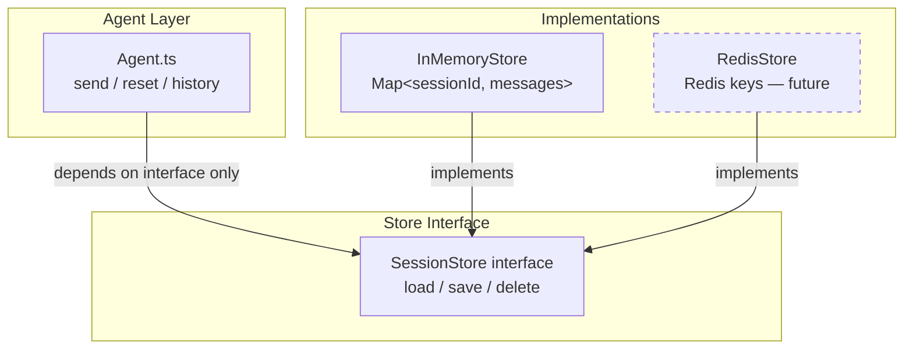
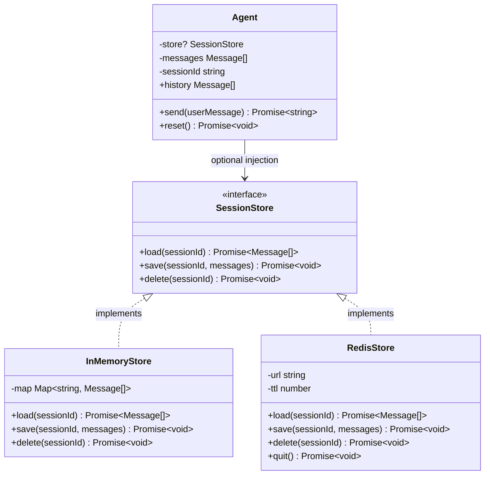
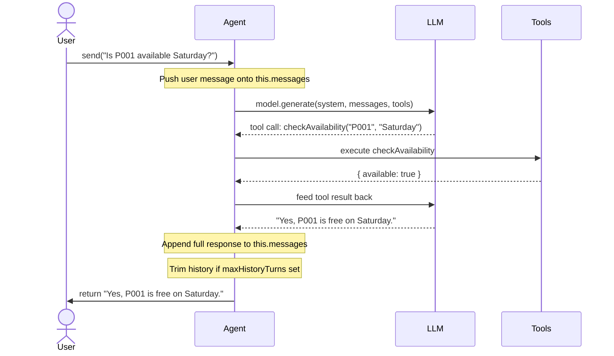
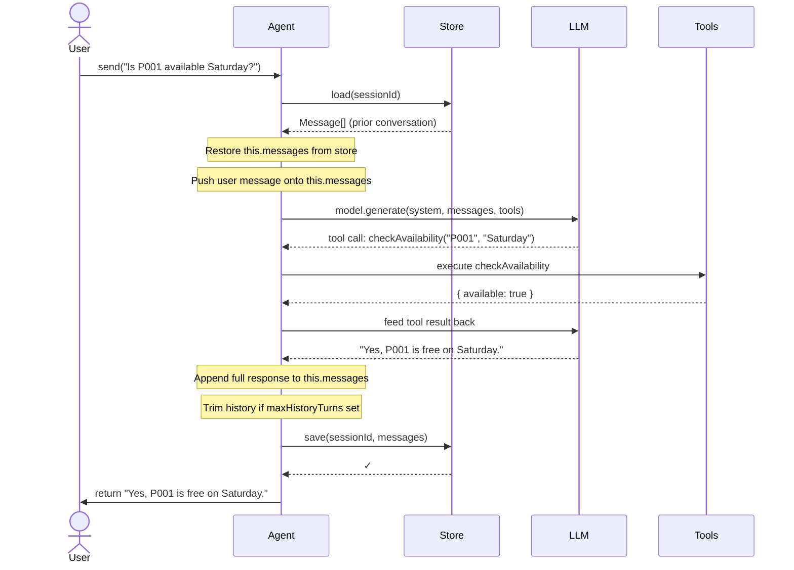
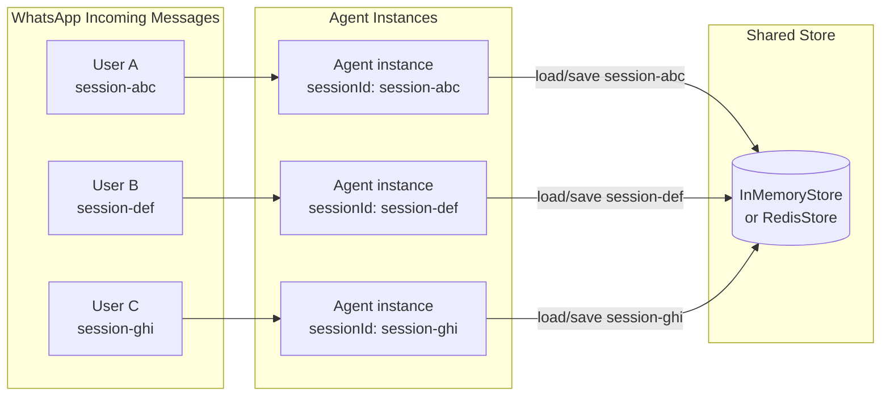
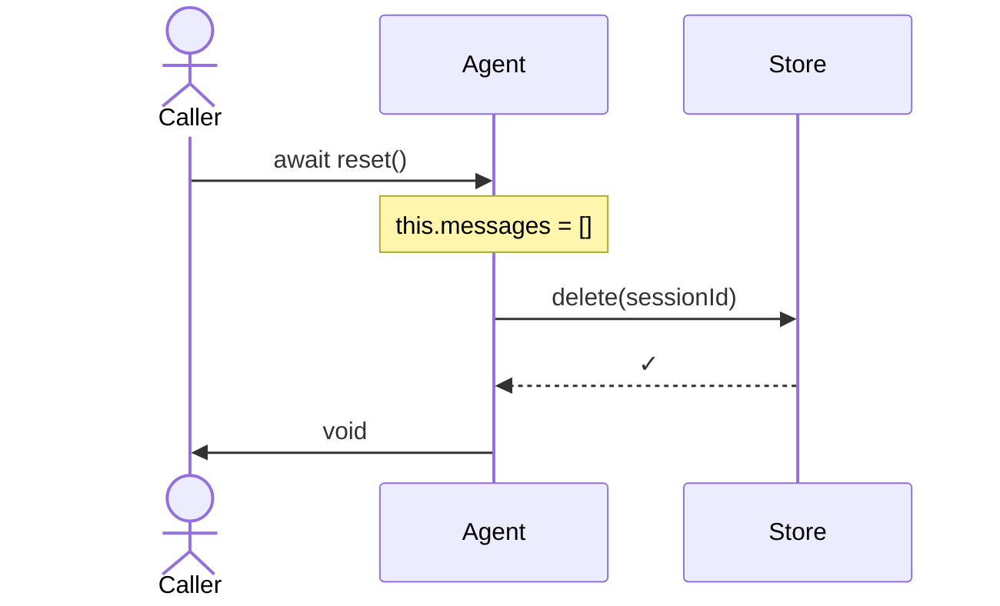

# Session Memory — How It Works

## The Problem

Every WhatsApp conversation is a separate session. When a user sends a message, the agent needs to remember what was said earlier in that conversation — "it" in "Is it available Saturday?" only makes sense if the agent remembers the user previously asked about P001.

Before the `SessionStore` abstraction, each `Agent` instance held its conversation history in a private array inside the object itself. This had two hard limits:

- **Process restart = memory loss.** A crash or redeploy wiped every active conversation.
- **Single process only.** If two Node.js workers were handling WhatsApp webhooks, each had its own isolated memory — the same user's messages could be routed to different workers with no shared history.

The `SessionStore` abstraction separates *the agent's logic* from *where history is stored*, making the storage layer pluggable.

---

## Architecture Overview



The `Agent` class imports only the `SessionStore` interface, never a concrete implementation. The caller decides which store to inject — this is dependency inversion: the agent does not know or care whether history lives in RAM or Redis.

---

## The SessionStore Interface

```typescript
interface SessionStore {
  load(sessionId: string): Promise<Message[]>;   // fetch history for a session
  save(sessionId: string, messages: Message[]): Promise<void>;  // persist history
  delete(sessionId: string): Promise<void>;          // wipe history (e.g. on reset)
}
```

`Message` is the project-owned message type. It covers user messages, assistant replies, tool call requests, and tool call results without exposing provider SDK types to stores. Storing the full array (not just the text) is what lets the model reason about what it already looked up.

---

## Class Relationships



---

## How `send()` Works — Step by Step

### Without a store (default behaviour)

When no store is provided, `Agent` manages its own `messages` array in-process. This is identical to the original behaviour.



### With a store

When a `SessionStore` is injected, two extra steps bookend the LLM call: load history at the start, save it at the end.



The key insight: **`this.messages` is rebuilt from the store at the start of every `send()` call.** This means:

- A new `Agent` instance created mid-conversation for the same `sessionId` will immediately have the correct history.
- Two different `Agent` instances with the same `sessionId` and the same store will never have conflicting state — the store is always the source of truth.

---

## Why History Is Loaded on Every `send()` Call

It might seem wasteful to load history on every call when you could just keep it in the object. But loading every time is what makes the store meaningful:

| Scenario | Without load-every-call | With load-every-call |
|---|---|---|
| New Agent instance for existing session | Empty history — conversation lost | Full history restored |
| Process restarts mid-conversation | History gone | History survives (with Redis) |
| Two workers handle same user | Diverging histories | Both see same store state |

---

## `InMemoryStore` — How It Works

`InMemoryStore` is a `Map<sessionId, Message[]>` with one important detail: **both `load` and `save` copy the array with spread.**

```
Store Map
┌─────────────────────────────────────────────────────────────────┐
│  "session-001"  →  [msg1, msg2, msg3]  ← stored snapshot       │
│  "session-002"  →  [msg1, msg2]                                 │
│  "session-003"  →  []                                           │
└─────────────────────────────────────────────────────────────────┘

On load("session-001"):  returns [...stored]  ← a copy, not the same reference
On save("session-001"):  stores [...messages] ← a copy, not the agent's live array
```

Without the copies, `trimHistory()` inside `Agent` would silently mutate the stored snapshot (because JavaScript objects and arrays are passed by reference). The spread ensures the store's snapshot and the agent's working array are always independent.

`InMemoryStore` survives for the lifetime of the Node.js process. It does **not** survive restarts — that is Redis's job.

---

## Multi-Session Isolation

Multiple sessions share one store instance but remain fully isolated because all reads and writes are keyed by `sessionId`.



Each agent only ever reads and writes its own `sessionId` key. Sessions never bleed into each other.

---

## `reset()` Behaviour

`reset()` is now async. It clears `this.messages` in-memory and, if a store is configured, also deletes the session from the store.



After `reset()`, the next `send()` call will load an empty array from the store — the conversation starts fresh.

---

## `RedisStore` — The Production Path

`RedisStore` is a fully-typed stub. The `ioredis` client code is written out in comments but inactive. When activated, it stores each session as a JSON-serialised Redis key:

```
Redis key scheme:  session:{sessionId}
Example:           session:session-1715000000000

Value:             JSON array of Message objects
TTL:               86400 seconds (24 hours) by default — configurable via constructor
```

The 24-hour TTL means sessions that go quiet automatically expire without manual cleanup.

### Activation steps

```bash
# 1. Install the client
pnpm add ioredis

# 2. Set the connection URL in .env
REDIS_URL=redis://localhost:6379

# 3. Uncomment the four marked sections in src/store/RedisStore.ts
#    (the import, the client field, the constructor body, the method bodies)
```

Then swap the store at the entry point:

```typescript
import { RedisStore } from './store/RedisStore.js';

const store = new RedisStore();  // reads REDIS_URL from env automatically
const agent = createPropertyAgentAssistant(sessionId, { store });

// On process exit — flush the Redis connection cleanly
process.on('beforeExit', () => store.quit());
```

You can inspect live sessions with:

```bash
redis-cli keys 'session:*'
redis-cli get 'session:session-1715000000000'
```

---

## Choosing the Right Store

| | `no store` | `InMemoryStore` | `RedisStore` |
|---|---|---|---|
| **History survives restart** | No | No | Yes |
| **Multiple workers** | No | No | Yes |
| **Zero dependencies** | Yes | Yes | No (ioredis) |
| **Zero latency** | Yes | Yes | No (network) |
| **Best for** | Dev / demos | Single-process testing | Production |

---

## Wiring It Up in `run.ts`

No store (current default — zero behaviour change):

```typescript
const agent = createPropertyAgentAssistant(sessionId);
```

With `InMemoryStore` (cross-instance continuity within one process):

```typescript
import { InMemoryStore } from './store/InMemoryStore.js';

const store = new InMemoryStore();
const agent = createPropertyAgentAssistant(sessionId, { store });
```

With `RedisStore` (production, after activation):

```typescript
import { RedisStore } from './store/RedisStore.js';

const store = new RedisStore({ ttl: 3600 }); // 1-hour session expiry
const agent = createPropertyAgentAssistant(sessionId, { store });
```
